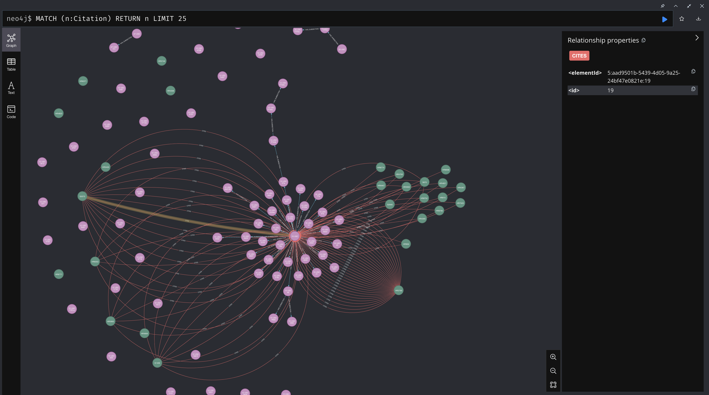

# The Semantic Citation Challenge

The current dataset tells you _where_ citations appear, but not _why_ they appear. Consider:

- How might the surrounding context be used to infer whether a citation supports a legal argument, establishes precedent, or provides clarification?
- Could network analysis reveal clusters or patterns that hint at different citation roles?

Your innovative solutions to add semantic labels or classifications to these citations could transform this dataset into a powerful tool for legal analysis, alerting, etc.

---

## Repository Structure

**sample_bills/**  
Contains plain-text legislative bill documents. These represent the source texts from which citation data were derived.

**citations/**  
Contains:

- **JSON files:** Each file corresponds to a bill and lists detected legal citations (with positional metadata). Note that these files include only structural information about citations—not any semantic labels.
- **Visualization & Analysis Scripts:**
  - `sankey_visualization.py` & `sankey_data_processing.py`: Generate interactive Sankey diagrams to illustrate how bills connect to various legal provisions.
  - `prepare_for_neo4j.py`: Converts citation data into CSV files for import into a Neo4j graph database.

---

## JSON Key Definitions

Each JSON file in the repository contains one or more citation objects. Below is an explanation of the keys used in these objects:

| **Key**                  | **Description**                                                                                                                                                              |
|--------------------------|------------------------------------------------------------------------------------------------------------------------------------------------------------------------------|
| **text**                 | The original citation string extracted from the bill text. This is exactly as it appears in the source document.                                                              |
| **startPosition**        | The character index in the source text where the citation begins.                                                                                                          |
| **endPosition**          | The character index in the source text where the citation ends.                                                                                                            |
| **normCite**             | A normalized version of the citation text, standardized for consistency (e.g., ensuring uniform formatting for legal citations).                                               |
| **citeType**             | Indicates the type or category of the citation (for example, "USC" for United States Code, "CFR" for Code of Federal Regulations, etc.).                                    |
| **altCite**              | An alternative representation of the citation, if available. This may offer additional formatting or details not present in the primary citation string.                     |
| **pinCiteStr**           | A string used for pinpoint references within a larger citation, indicating a specific location (if applicable).                                                              |
| **pageRangeStr**         | A string representing the page range when a citation spans multiple pages.                                                                                                   |
| **nodeId**               | A unique identifier assigned to the citation object, which is useful for linking and referencing within visualizations or other processing tools.                           |
| **section**              | A parsed component of the citation that typically corresponds to a legal section number (if the citation includes such a breakdown).                                         |
| **sectionAndSubSection** | A more detailed breakdown that includes both the section and any subsections, providing a hierarchical view of the citation reference.                                      |
| **isShortCite**          | A boolean flag indicating whether the citation is a shortened reference (true) or a full citation (false).                                                                    |

---

## Related Research

To help bootstrap your creative problem-solving, here are some research papers that address related challenges in legal citation analysis and broader legal NLP:

### Citation-Specific Approaches

- **Automatic Semantic Edge Labeling over Legal Citation Graphs**  
  [Read the paper](https://dsr.cise.ufl.edu/wp-content/uploads/2018/03/Automatic_Semantic_Edge_Labeling_over_Legal_Citation_Graphs.pdf)  
  _Summary:_

  - Develops an algorithm to automatically label citation edges based on their surrounding text.
  - Uses a CRF model and clustering techniques to assign purpose-based labels.
  - Compares machine performance to human accuracy in labeling legal citations.

- **Context-Aware Legal Citation Recommendation using Deep Learning**  
  [Read the paper](https://dho.stanford.edu/wp-content/uploads/icail-2021.pdf)  
  _Summary:_

  - Proposes a citation recommendation tool using multiple machine learning approaches.
  - Highlights the importance of local textual context for accurate citation prediction.
  - Compares deep learning models with traditional methods for legal citation tasks.

- **Prototype-Based Interpretability for Legal Citation Prediction**  
  [Read the paper](https://aclanthology.org/2023.findings-acl.301.pdf)  
  _Summary:_

  - Addresses the need for interpretability in legal citation prediction systems.
  - Introduces a prototype architecture that incorporates expert feedback for labeling citations.
  - Emphasizes aligning model predictions with legal reasoning processes.

- **Similar Cases Recommendation using Legal Knowledge Graphs**  
  [Read the paper](https://arxiv.org/html/2107.04771v2)  
  _Summary:_
  - Constructs a legal knowledge graph from diverse legal documents.
  - Uses the graph to recommend similar cases and analyze case similarity.
  - Discusses challenges in leveraging legal graphs for natural language applications.

### Broader Legal NLP and Semantic Research

- **A Meta-Analysis of Semantic Classification of Citations**  
  [Read the paper](https://direct.mit.edu/qss/article/2/4/1170/107610/A-meta-analysis-of-semantic-classification-of)  
  _Summary:_

  - Reviews 60 scholarly articles on citation classification.
  - Emphasizes automated methods using machine learning and NLP to analyze the linguistic context around citations.
  - Highlights research gaps and challenges in accurately classifying citation semantics.

- **A Survey on Challenges and Advances in Natural Language Processing with a Focus on Legal Informatics and Low-Resource Languages**  
  [Read the paper](https://www.mdpi.com/2079-9292/13/3/648)  
  _Summary:_

  - Surveys recent NLP research applied to legislative documents.
  - Discusses the unique challenges in legal informatics, especially in low-resource language settings.
  - Provides insights into state-of-the-art NLP tasks and methods tailored for the legal domain.

- **Deep Learning-Based Semantic Segmentation for Legal Texts: Unveiling Rhetorical Roles in Legal Case Documents**  
  [Read the paper](https://www.e3s-conferences.org/articles/e3sconf/pdf/2024/59/e3sconf_icsmee2024_04019.pdf)  
  _Summary:_

  - Explores using deep learning to assign rhetorical role labels (e.g., Argument, Fact, Judgment) to sentences in legal case documents.
  - Focuses on segmenting lengthy, unstructured legal texts to reveal underlying document structure.
  - Evaluates the effectiveness of various deep learning models in capturing legal argumentation.

- **Natural Language Processing for the Legal Domain: A Survey of Tasks, Datasets, Models, and Challenges**  
  [Read the paper](https://www.researchgate.net/publication/385352804_Natural_Language_Processing_for_the_Legal_Domain_A_Survey_of_Tasks_Datasets_Models_and_Challenges)  
  _Summary:_

  - Provides an overview of key NLP tasks specific to legal texts, including summarization, named entity recognition, question answering, and judgment prediction.
  - Discusses challenges such as document length, language complexity, and scarcity of open legal datasets.
  - Identifies open research challenges like bias, interpretability, and the need for more robust legal language models.

- **The Law and NLP: Bridging Disciplinary Disconnects**  
  [Read the paper](https://aclanthology.org/2023.findings-emnlp.224.pdf)  
  _Summary:_

  - Argues that a disconnect exists between legal practice and current NLP research.
  - Explores how legal NLP tasks could better serve the needs of legal practitioners.
  - Highlights underexplored areas that may help bridge the gap between legal expertise and computational methods.

- **Using Machine Learning on Legal Matters: Paying Attention to the Data Behind the Curtain**  
  [Read the paper](https://repository.uclawsf.edu/cgi/viewcontent.cgi?article=1091&context=hastings_science_technology_law_journal)  
  _Summary:_
  - Examines how machine learning can improve the document review process in large-scale litigation.
  - Demonstrates that tuning model settings can dramatically impact performance.
  - Provides insights into optimizing predictive models for more effective legal document classification.

---

## Visualizations

Below are examples of the visualizations you can generate using this toolkit:

**Graph Visualization (Neo4j):**  
 

**Sankey Diagram:**  
 

---

## Getting Started

### Prerequisites

- **Python 3.x**
- Create a virtual environment:
  ```bash
  python -m venv venv
  source venv/bin/activate  # On Windows use `venv\Scripts\activate`
  ```
- Install the required packages:
  ```bash
  pip install -r requirements.txt
  ```

### Running the Tools

1. **Visualize the Citation Network (Sankey Diagram):**

   ```bash
   python sankey_visualization.py
   ```

   This will create an interactive HTML visualization (e.g., `artifacts/citation_sankey.html`).

2. **Prepare Data for Neo4j:**
   ```bash
   python prepare_for_neo4j.py
   ```
   Follow the on-screen instructions to import the resulting CSV files into your Neo4j instance.

---

Your creative solutions can help move beyond simply identifying citations toward understanding their legal significance. Happy exploring—and we look forward to your innovative approaches to semantic citation analysis!
